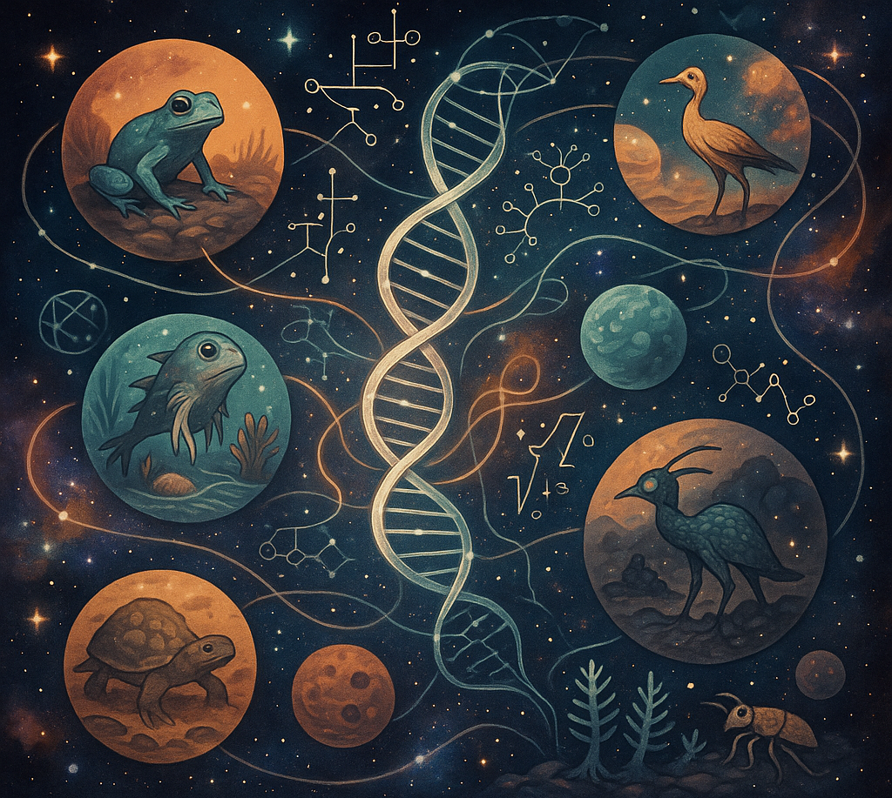

<h1 style="color: #dfdfdf; text-shadow: 2px 2px 4px #400000;">Universal Biology</h1>

$\\$

<h4 style="color: #dfdfdf; text-shadow: 2px 2px 4px #400000;"> A physicist's approach to "What is Life?"</h4>

$\\$

Riz Fernando Noronha

---

"Universal Biology" coined by a **Sci-Fi Author**:

$\\$

> *Universal biology – science to explore universal patterns and possible variations of living organisms in this cosmos. It started to expand the end of last century. Since then, characterization of life in terms of topological geometry has developed, and now, a grand theory comparable to relativity is anticipated…*

-Sakyo Komatsu

---

### Explaining More with Less

$\\$

Living systems are **complex**

A single bacteria has ~5000 proteins

We can predict/fit, but not explain and understand

---

### Thermodynamics

$\\$

Microscopically, too many particles!

Macroscopically, we can describe the system

Only a **few variables** needed!

---

### Thermodynamic Framework of Universal Biology

---

## What is Life?

$\\$

Over **100** different defintions!

Life needs to **maintain itself**

Life needs to be able to **reproduce**

---

...but that's not enough!

---

**NASA** add that life needs **Darwinian Evolution**.

Perhaps a higher-level process?

---

## The Origin of Life

$\\$

Life evolved from **chemicals**.

---

### Compartmentalization

---

### Ecosystems

**Long-term** experiment

---

## Across Length Scales

---

### Function vs Information

There's a *symmetry break!*

The parts of a living system can often be 

---

## Conclusion
