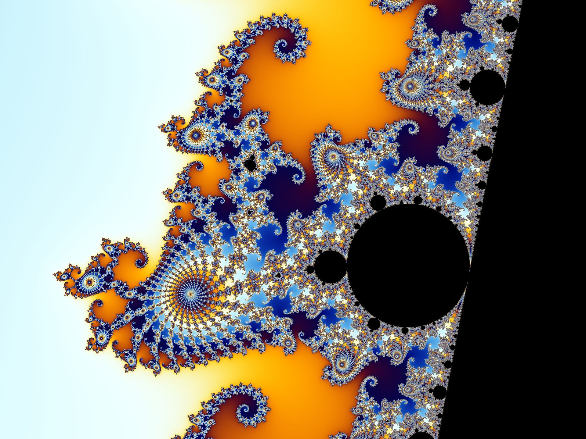
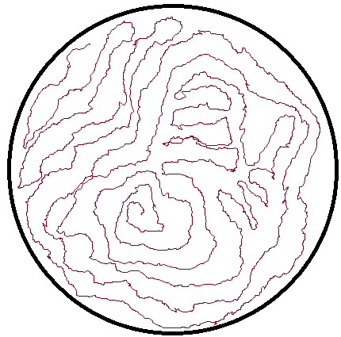
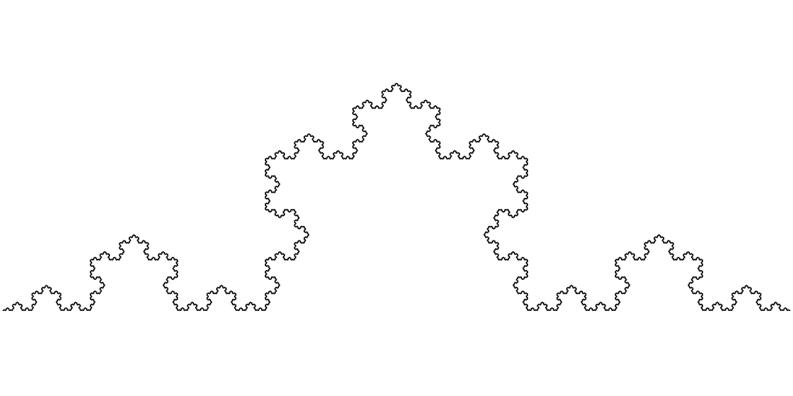

<h1 style="color: #dfdfdf; text-shadow: 2px 2px 4px #400000;">Fractals:   The Language of Nature</h1>

$\\$

Riz Fernando Noronha

--- 

## The Koch Curve

<iframe width="auto" height="1000px" src="https://rizfn.github.io/fractalsPresentation/koch_construction/" style="border: 1px solid #cccccc" frameborder=0>
</iframe>

---

## Try!!

$\\$

- Have you ever seen **fractals in nature**?

- Try to **construct your own fractal**, iteratively! Sketch a few iterations, and see what you get!

---

## Fractals in Nature!!

 .jpg)

---

---

## ~~Defining~~ Describing a fractal

- Self-similarity
- Detailed structure at small scales
- "Irregularity" 

   

---

### Measuring Length:

- We can use a line!

 

---

<iframe width="auto" height="1000px" src="https://rizfn.github.io/fractalsPresentation/koch_measure/length.html" style="border: 1px solid #cccccc" frameborder=0>
</iframe>

---

### Length isn't enough?

- A disc has infinite length!
- We measure an 'area' instead.

---

<iframe width="auto" height="1000px" src="https://rizfn.github.io/fractalsPresentation/koch_measure/area.html" style="border: 1px solid #cccccc" frameborder=0>
</iframe>

---

- Length measures things in **1D**.
  - Objects >1D have $L=\infty$

- Area measures things in **2D**.
  - Objects <2D have $A=0$

$$\\$$

- The curve has $L=\infty$ and $A=0$!
- Dimesion $1 < D < 2$ !?

---

## Intended Learning Outcomes

$\\$

After this lesson, the participants should be able to

- *Identify* fractals in nature
- *Characterize* qualities that make a fractal
- *Describe* why a fractional dimension could be necessary to measure such objects

