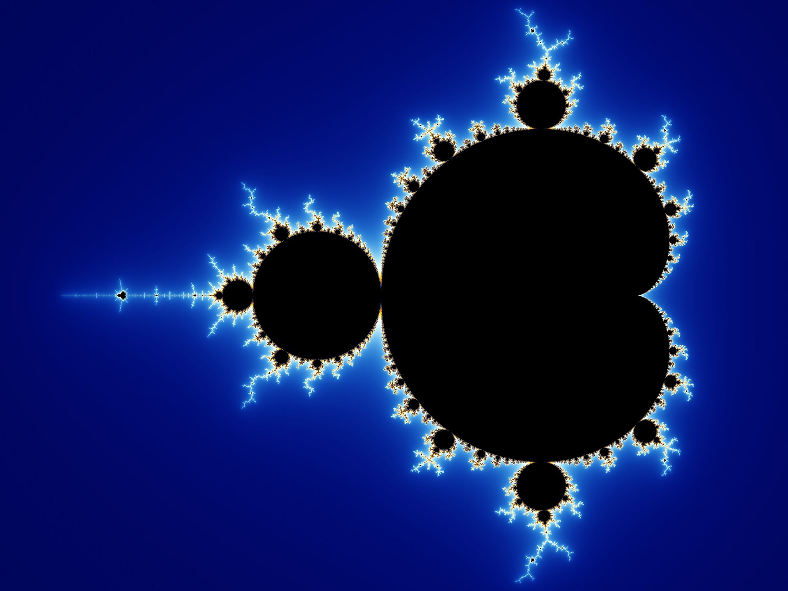

<h1 style="color: #dfdfdf; text-shadow: 2px 2px 4px #400000;">Fractals:   The Language of Nature</h1>

$\\$

Riz Fernando Noronha

---

---

## Sierpinski Triangle!

 

---

### Karl Weierstrass

 

- Flunked out of university

- Hardly published

- Wrote in the _school newspaper_

- Still an exceptional mathematician!!

--- 

- Studied **continuity** and **differentiability**.

- Contested Ampere's "proof" that
   continuity $\rightarrow$ differentiability [(more complex)](https://hsm.stackexchange.com/questions/3480/is-kline-right-that-cauchy-believed-that-continuous-functions-must-be-differenti)

$$f(x) = \sum_{n=0}^\infty a^n \cos\left(b^n\pi x\right)$$

for $0\lt a\lt1$; $b$ is a positive odd integer; and
$ab \gt 1 + \frac32\pi$

---

### Weierstrass Function

---

---

Cantor (?)

---

## 1918

- **Felix Hausdorff** introduces a 'Haussdorf dimension'

 

- **Pierre Fatou** and **Gaston Julia** study complex dynamics.
  Repeatedly *iterate* on a complex function.

---

## Benoit Mandelbrot

 

- Born in 1924 in Warsaw
- Uneven education (WW2)
- Favoured **Visual** arguments over proofs!

---

---

Beautiful behaviour on zooming in!

   

   

---

<iframe width="auto" height="1000px" src="https://marksmath.org/visualization/julia2.html" style="border: 1px solid #cccccc" frameborder=0>
</iframe>

--- 

## The Koch curve
 

Swedish (ew) mathematician
 

More *intuitive* version of Weierstrass's result, through **geometry**

---

## Construction

<iframe width="auto" height="1000px" src="https://rizfn.github.io/fractalsPresentation/koch_construction/" style="border: 1px solid #cccccc" frameborder=0>
</iframe>

---

<iframe width="auto" height="1000px" src="https://rizfn.github.io/fractalsPresentation/koch_measure/length.html" style="border: 1px solid #cccccc" frameborder=0>
</iframe>

---

<iframe width="auto" height="1000px" src="https://rizfn.github.io/fractalsPresentation/koch_measure/area.html" style="border: 1px solid #cccccc" frameborder=0>
</iframe>

---

<iframe width="auto" height="1000px" src="https://rizfn.github.io/fractalsPresentation/koch_construction/cesaro_multiple.html" style="border: 1px solid #cccccc" frameborder=0>
</iframe>

---

"Length" and "Area" are *useless* here.

$\\$
$\\$

We need a **new way** to measure!

---

### Box-counting

<iframe width="auto" height="1000px" src="https://rizfn.github.io/fractalsPresentation/box_count/" style="border: 1px solid #cccccc" frameborder=0>
</iframe>

---

<iframe width="auto" height="1000px" src="https://rizfn.github.io/fractalsPresentation/box_count/koch.html" style="border: 1px solid #cccccc" frameborder=0>
</iframe>

---

## Fractals in Nature!!

 .jpg)

---

---

### "Forgeries"

_Kevin Musgrave_ showed these at Yale in 1993.

 

---

---

#### Barnsley's Fern

 

Simple instructions!

---

## Fractals in biophysics

 

---

### It's just pushing!

 

---

---

## Complex Physics

Simple rules, giving complex behaviour.

---

#### "Fractal" like scaling

<iframe width="auto" height="1000px" src="https://rizfn.github.io/fractalsPresentation/circles_powerlawdist/" style="border: 1px solid #cccccc" frameborder=0>
</iframe>

---

### Bureaucracy

---

Add in the center!
 
Number of *times* a site topples

---

---

#### The Irony of Weierstrass

- > _Nature is simple, we shouldn't be biased by it!_
 
- Nature, as it turns out, is **NOT** smooth and simple!
 
- Fractals show up everywhere!

---

## Conclusion

> _I find the ideas in the fractals, both as a body of knowledge and as a metaphor, an incredibly important way of looking at the world._

  
- Al Gore, discussing some of the "big think" questions that intrigue him

