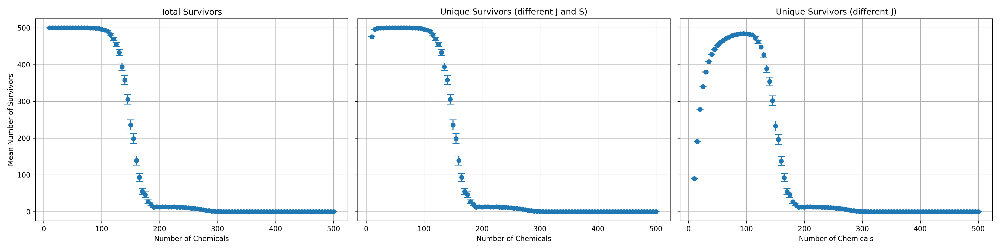

# Modelling multi-species ecosystems

$\\$

Riz Fernando Noronha

---

### Predator-Prey Models

$\\$

<!--  -->

$$
\begin{align}
\frac{\mathrm{d}x}{\mathrm{d}t} &= \alpha x - \beta xy \\ \\
\frac{\mathrm{d}y}{\mathrm{d}t} &= \delta xy - \gamma y
\end{align}
$$

---

### How do we model many species??

$\\$

Every species (possibly) interacts with every other species

$N$ species implies $\sim N^2$ interactions!!

---

### On the Micro-scale?

<video src="fig/phd_fundamentals/t6ss_vibriocyclitrophicus_ordalii.mp4" autoplay muted loop></video>

- Type 6 Secretion System (**T6SS**)

- Vibrio cyclitrophicus

- Vibrio ordalii

- Damages cell membrane (becomes circular)

---

### Real Microbial Communities

$\\$

T6SS is relatively **uncommon**

Microbes interact through chemicals

**Secretion** and **uptake**

---

<video src="fig/phd_fundamentals/lattice_anim_N_50_theta_0.1_1.mp4" autoplay muted loop style="max-width:100%;"></video>

### Lattice model
 

- Spatial patterning present

- Invasion between ecosystems?

---

### 'AND' model

- Each species needs **2** chemicals to reproduce!

- Each species also secretes 2

- You **cannot** secrete what you need!

---

#### Lack of resource variety drives diversity?!

$\\$

---

## Conclusion

$\\$

- Multi-species modelling is arbitrary!

- More work needed!
    - Analysis of mean-field results
    - Different behaviour in spatial model